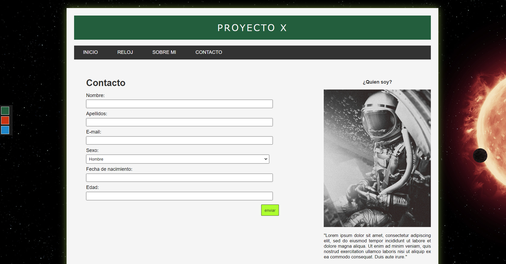

# LANDING PAGE 
_This project was a html and css mockup practice add interactivity to the site using jquery_

## Built with 🛠️
* [HTML]()
* [CSS]()
* [jQuery]()
* [jQuery-ui]()
* [jQuery-validation]()
* [Moment js]()

 There are differents themes, you can choose between three (BLUE, RED AND DEFAULT GREEN), 
clicking on a three-square menu in the middle left.

_GREEN THEME_

_BLUE THEME_

_RED THEME_

## MORE UTILITIES
In main menu there are three more options than default 'INICIO'.

_CLOCK_  
Thre are a clock updating in real time, was made using moment and jQuery.

_ABOUT ME_  
There are an acordeon of jQuery-UI utilities.

_CONTACT_  
There are a form validated with jQuery-validate

---
⌨️ with ❤️ by [cesarevc](https://github.com/cesarevc) 